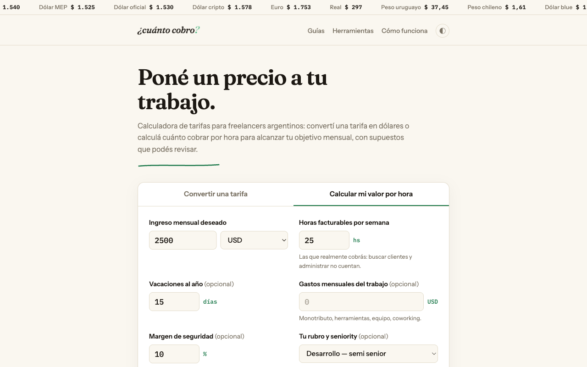

# ¿Cuánto cobro?

[](https://github.com/SebastianElustondo/cuanto-cobro/actions/workflows/ci.yml)
[](LICENSE)
[](https://cobro.quovra.com)

Herramientas y guías de plata para freelancers argentinos: qué cobrar por hora, cuánto queda después de la comisión y el tipo de cambio, qué categoría de monotributo corresponde y cuánto facturar para igualar un sueldo.

**[cobro.quovra.com](https://cobro.quovra.com)**

[](https://cobro.quovra.com)

## Herramientas

| Página | Qué hace |
|---|---|
| [`/`](https://cobro.quovra.com/) | **Conversor de tarifa** (USD → ARS con blue, MEP, oficial y cripto en vivo, comisión de la plataforma), **calculadora inversa** ("quiero ganar X por mes trabajando Y horas") y comparación con **tarifas de referencia** por rubro y seniority. |
| [`/presupuesto`](https://cobro.quovra.com/presupuesto) | **Presupuestador de proyectos**: horas × tarifa, imprevistos, gastos directos, adelanto, y una hoja imprimible. |
| [`/monotributo`](https://cobro.quovra.com/monotributo) | **Calculadora de monotributo**: categoría y cuota mensual según facturación, con las escalas vigentes de ARCA. |
| [`/empleado-vs-freelance`](https://cobro.quovra.com/empleado-vs-freelance) | **Empleado vs freelance**: cuánto facturar para igualar un sueldo neto, aguinaldo, prepaga y monotributo incluidos. |

Y seis **guías** en [`/guias/`](https://cobro.quovra.com/guias/): monotributo, factura E, cobrar del exterior, dólar MEP, presupuestar un proyecto y subir la tarifa a un cliente.

## Cómo está hecho

Sitio estático servido por Cloudflare Pages. HTML, CSS y JavaScript sin build, sin framework y sin dependencias en producción. El único dato externo es la cotización del dólar.

```
                 ┌──────────────┐  fetch, 8 s de timeout   ┌───────────────┐
  navegador ───▶ │  js/app.js   │ ───────────────────────▶ │  dolarapi.com │
                 └──────┬───────┘                          └───────────────┘
                        │ ok → guarda en localStorage (última cotización conocida)
                        │ falla → restaura la última guardada y lo dice en pantalla
                        │ nada guardado → modo manual: el usuario escribe la cotización
                        ▼
                 ┌──────────────┐
                 │  js/calc.js  │  fórmulas puras (sin DOM): convertir, tarifaInversa,
                 └──────────────┘  presupuesto, posicionEnRango → probadas en Node
```

- **`js/calc.js`** y **`js/monotributo-data.js`** son funciones puras: reciben números y devuelven números. Todo lo que se puede equivocar en una cuenta vive ahí y tiene tests.
- **`js/util.js`** concentra lo que todas las páginas repetían: lectura de números con coma decimal, formato de moneda es-AR, acceso al DOM.
- **`js/tema.js`** aplica el modo claro/oscuro guardado antes del primer render (por eso se carga en el `<head>` sin `defer`) y mantiene el botón accesible.
- **Degradación**: si la API no responde, primero se usa la última cotización guardada en ese navegador, con la antigüedad a la vista; si tampoco hay, la calculadora sigue funcionando con una cotización manual.
- **Enlaces compartibles**: el estado de la calculadora se serializa en la URL, y los enlaces viejos siguen resolviendo aunque cambien las claves internas.

## Decisiones

**Sin build ni framework.** Son cuatro formularios y seis artículos. Un framework agregaría una cadena de build, dependencias que envejecen y kilobytes que el usuario paga en cada visita, a cambio de nada que el problema pida. El costo de esta decisión es la duplicación de cabecera y pie entre páginas; se acepta mientras sean quince.

**JavaScript ES5 a propósito.** El público incluye gente con teléfonos viejos. El código corre tal cual, sin transpilar, y ESLint está configurado para ese dialecto.

**Content Security Policy estricta.** `script-src 'self'` sin `unsafe-inline`: no hay scripts en línea, ni siquiera el del tema. Las cabeceras están en `_headers` y las aplica Cloudflare Pages.

**Sin salto de layout.** El ticker reserva su alto antes de tener datos, las cajas de texto se miden en `em` (no en `ch`, que cambia con la fuente) y las fuentes de respaldo tienen `size-adjust` medido sobre un párrafo real, para que Georgia y Arial ocupen el mismo ancho que Fraunces e Instrument Sans mientras descargan.

**Los datos oficiales viven en un solo lugar.** Las escalas del monotributo están una vez, en `js/monotributo-data.js`, con la fecha de vigencia; las dos herramientas que las usan las leen de ahí.

**Nada de tracking.** Cloudflare Web Analytics, sin cookies. No hay publicidad.

## Calidad

Cada push y cada pull request pasan por GitHub Actions:

| Paso | Herramienta | Qué cuida |
|---|---|---|
| `npm test` | `node --test` | Las fórmulas (9 casos, bordes incluidos) |
| `npm run lint` | ESLint 9 | Errores reales en el JS, dialecto ES5 |
| `npm run lint:html` | html-validate | HTML válido y accesible (scope en tablas, ARIA bien usado) |
| `npm run check:links` | script propio | Todo href/src interno y toda URL del sitemap apuntan a un archivo real |
| Lighthouse | lighthouse-ci | Accesibilidad y SEO ≥ 95, buenas prácticas ≥ 90, rendimiento ≥ 90 |

Lighthouse hoy, en las cuatro páginas medidas: rendimiento 100, accesibilidad 100, SEO 100.

## Correr local

```bash
npm ci                       # solo herramientas de desarrollo
python3 -m http.server 8080  # o cualquier servidor estático; no hay build
```

Para probar con las cabeceras reales (CSP incluida): `npx wrangler pages dev .`

## Estructura

```
index.html, presupuesto.html, monotributo.html, empleado-vs-freelance.html   herramientas
guias/                                                                        una página por guía
js/                                                                           un archivo por herramienta + calc, util, tema, monotributo-data
style.css                                                                     estilos (sistema "editorial financiera", modo oscuro)
_headers, robots.txt, sitemap.xml, 404.html                                   infraestructura del sitio
test.js, eslint.config.js, .htmlvalidate.json, lighthouserc.json              calidad
scripts/check-links.js                                                        chequeo de links internos
.github/workflows/ci.yml                                                      CI
```

## Deploy

Cloudflare Pages publica la raíz del repo en cada merge a `main`. No hay paso de build. `404.html` corta el fallback SPA de Pages para que las rutas inexistentes devuelvan 404 de verdad.

## Contribuir y seguridad

Issues y pull requests bienvenidos: ver [CONTRIBUTING.md](CONTRIBUTING.md). Para reportar un problema de seguridad, [SECURITY.md](SECURITY.md).

## Licencia

MIT. Las cifras de monotributo y las tarifas de referencia son orientativas; verificá siempre contra la fuente oficial.
